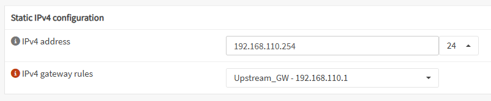
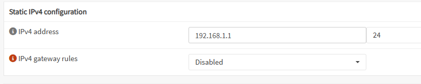
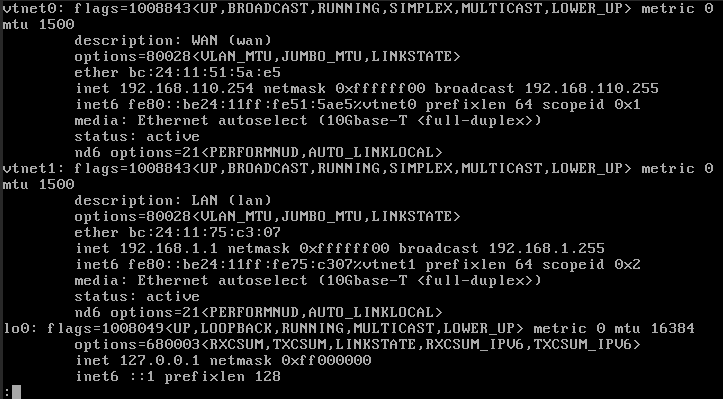
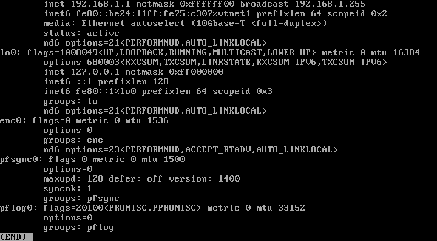
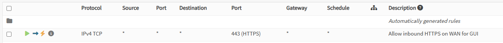
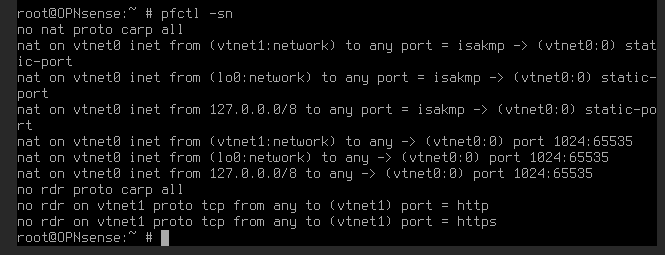

# OPNsense Configuration – Demo Lab

Denne side dokumenterer den grundlæggende netværkskonfiguration, interfaces og firewall-regler for OPNsense-instansen i vores labmiljø.

---

## WAN og LAN Interface Indstillinger

**WAN** er forbundet til `vmbr0` med følgende indstillinger:

**LAN** er forbundet til `vmbrlab` og fungerer som gateway for interne VM’er:

---

## IP Konfiguration (ifconfig output)

Den følgende terminaloutput viser netværksinterfaces og deres IP-konfiguration.

---

## Firewallregel for GUI-adgang

Her ses den automatisk genererede firewallregel, som tillader adgang til OPNsense WebGUI via HTTPS (port 443):

---

## DNAT / Port Forwarding Regler (pfctl)

DNAT-reglen er ikke synlig i webinterfacet, men kan verificeres via shell med `pfctl -sn`:

Dette viser, at der **ikke er en port forward-regel opsat i OPNsense GUI**, og DNAT bliver derfor håndteret af **Proxmox** via `iptables`.

---
