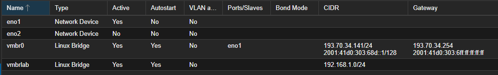
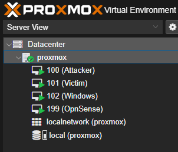

# Proxmox Network Configuration

Dette er den aktive netværkskonfiguration fra `/etc/network/interfaces` på Proxmox-hypervisoren.

```bash
auto lo
iface lo inet loopback

iface eno1 inet manual

iface eno2 inet manual

auto vmbr0
iface vmbr0 inet static
        address 193.70.34.141/24
        gateway 193.70.34.254
        bridge-ports eno1
        bridge-stp off
        bridge-fd 0
        hwaddress 00:25:90:A9:5C:5C

iface vmbr0 inet6 static
        address 2001:41d0:303:68d::1/128
        gateway 2001:41d0:303:6ff:ff:ff:ff:ff

auto vmbrlab
iface vmbrlab inet static
        address 192.168.1.0/24
        bridge-ports none
        bridge-stp off
        bridge-fd 0
```

## Proxmox Network Diagram


## Proxmox VMs

