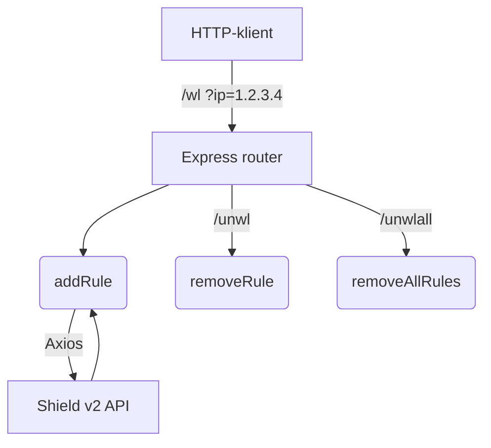

# Royale Hosting Shield-Manager

Dette mini-projekt udstiller et REST-interface til **automatiseret whitelisting**
af IP-adresser i Royale Hosting Shield.  
Tjenesten er skrevet i Node .js (Express + Axios).

!!! note "Formål"
    - Hurtigt tilføje / fjerne klient-IP’er til en firewall / DDoS-filter  
    - Automatisk håndtere konflikter i **order-feltet** på Shield-API’et  
    - Kun én letvægts-service

**Forudsætninger**

| Krav              | Version |
|-------------------|---------|
| Node.js           | ≥ 18    |
| Royale Shield API | v2      |
| Adgangstoken      | Gemt som miljøvariabel `SHIELD_API_KEY` |

Start serveren:

```bash
npm install
node server.js        # PORT kan sættes i env
```




# REST-end-points
```markdown
| Metode | Route      | Beskrivelse                                  |
|--------|------------|----------------------------------------------|
| GET    | `/wl`      | Tilføj (whitelist) en IP. Parameter: `ip`.   |
| GET    | `/unwl`    | Fjern regler for én IP. Parameter: `ip`.     |
| GET    | `/unwlall` | Slet alle auto-oprettede regler.             |
```


## Node-kildekode

```javascript title="server.js" linenums="1"
const express  = require('express');
const axios    = require('axios');
const app      = express();

const port            = process.env.PORT || 3000;
const SHIELD_API_BASE = 'https://shield.royalehosting.net/api/v2/rules/';
const SHIELD_API_KEY  = process.env.SHIELD_API_KEY;  // <REDACTED>
const SERVER_DEST     = '<REDACTED_CIDR>';            // fx 192.0.2.42/32

/* ---------- Hjælpefunktioner ---------- */

// 1) Find næste ledige order-værdi
async function getNextOrder() { /* … */ }

// 2) Opret regel med retry på order-konflikt
async function createRuleWithRetry(payload, maxAttempts = 5) { /* … */ }

/* ---------- CRUD-funktioner ---------- */

async function addRule(ip)       { /* … */ }
async function removeRule(ip)    { /* … */ }
async function removeAllRules()  { /* … */ }

/* ---------- Routes ---------- */

app.get('/wl',      async (req, res) => { /* … */ });
app.get('/unwl',    async (req, res) => { /* … */ });
app.get('/unwlall', async (req, res) => { /* … */ });

app.listen(port, '0.0.0.0', () =>****
  console.log(`Shield-manager kører på port ${port}`)
);
```