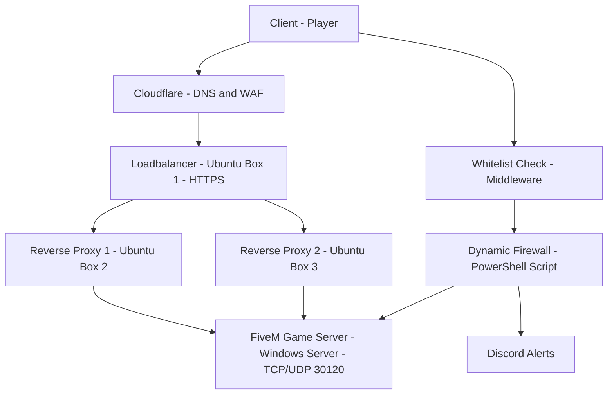

```mermaid
graph TD
    A[Client - Player] --> B[Cloudflare - DNS and WAF]
    B --> C[Loadbalancer - Ubuntu Box 1 - HTTPS]
    C --> D1[Reverse Proxy 1 - Ubuntu Box 2]
    C --> D2[Reverse Proxy 2 - Ubuntu Box 3]
    D1 --> E[FiveM Game Server - Windows Server - TCP/UDP 30120]
    D2 --> E
    A --> F[Whitelist Check - Middleware]
    F --> G[Dynamic Firewall - PowerShell Script]
    G --> E
    G --> H[Discord Alerts]
```
