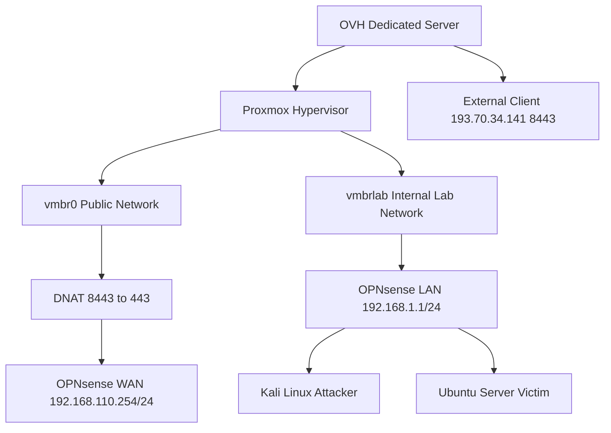

```mermaid
graph TD
    A[OVH Dedicated Server] --> B[Proxmox Hypervisor]
    B --> C[vmbr0 Public Network]
    B --> D[vmbrlab Internal Lab Network]
    C --> J[DNAT 8443 to 443]
    J --> E[OPNsense WAN 192.168.110.254/24]
    D --> F[OPNsense LAN 192.168.1.1/24]
    F --> G[Kali Linux Attacker]
    F --> H[Ubuntu Server Victim]
    A --> I[External Client 193.70.34.141 8443]

```